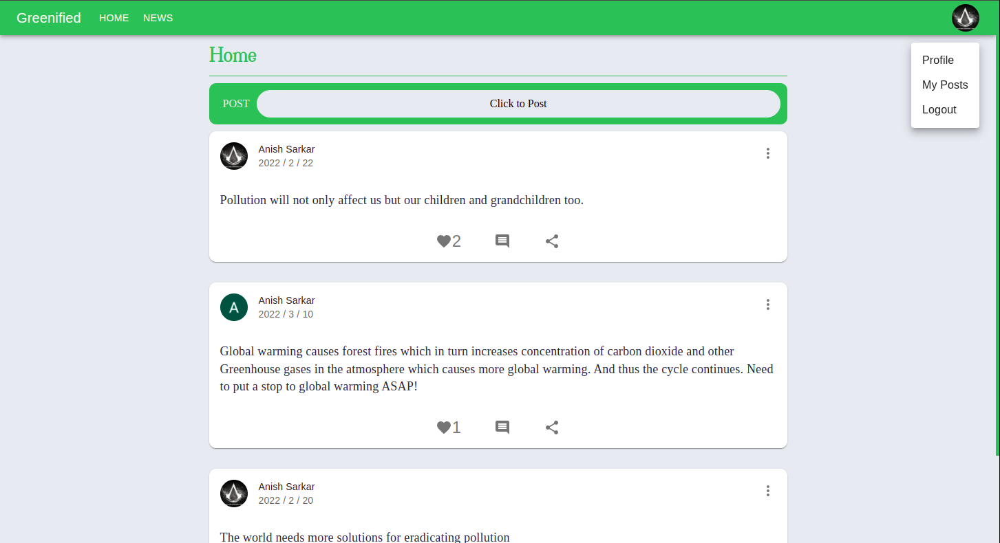
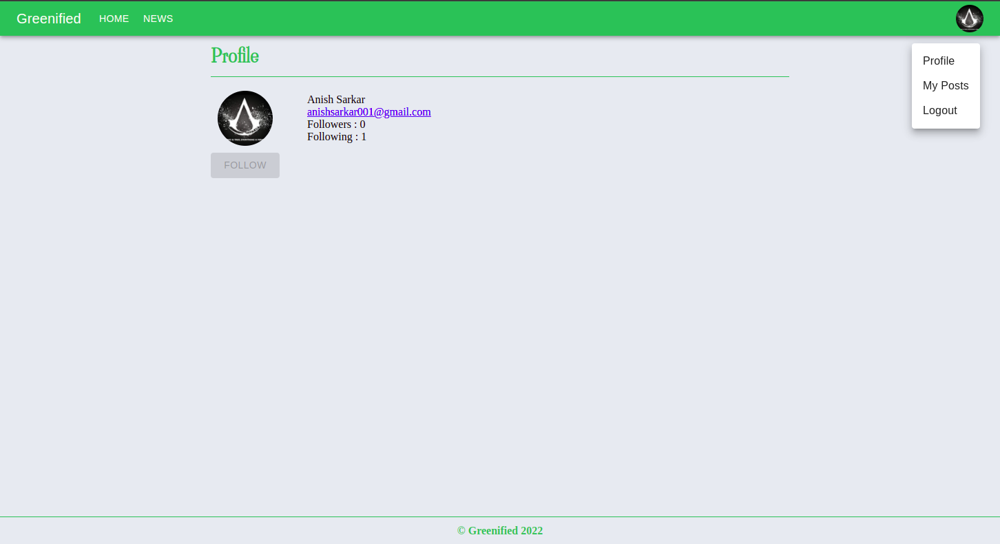
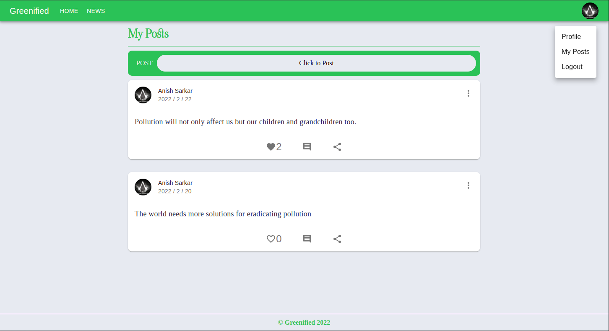
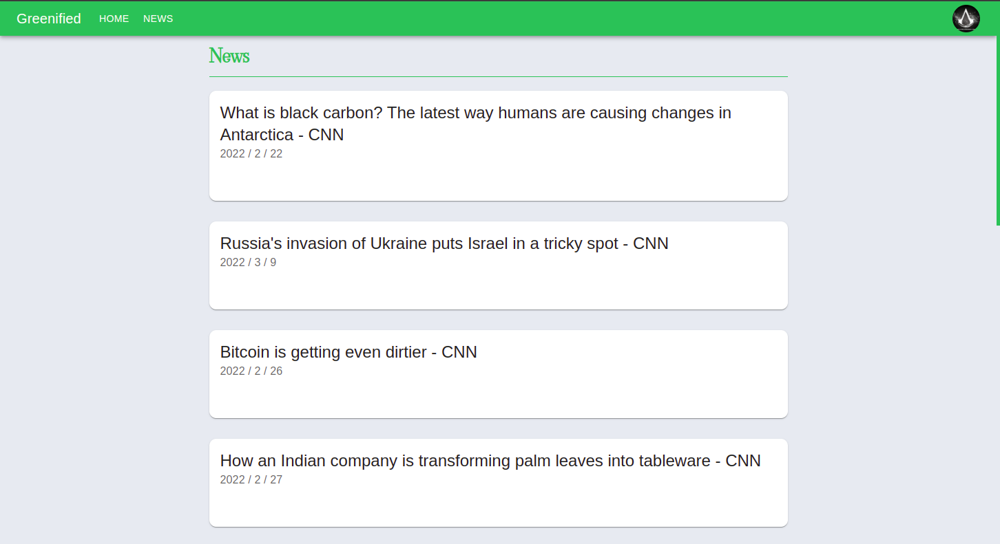
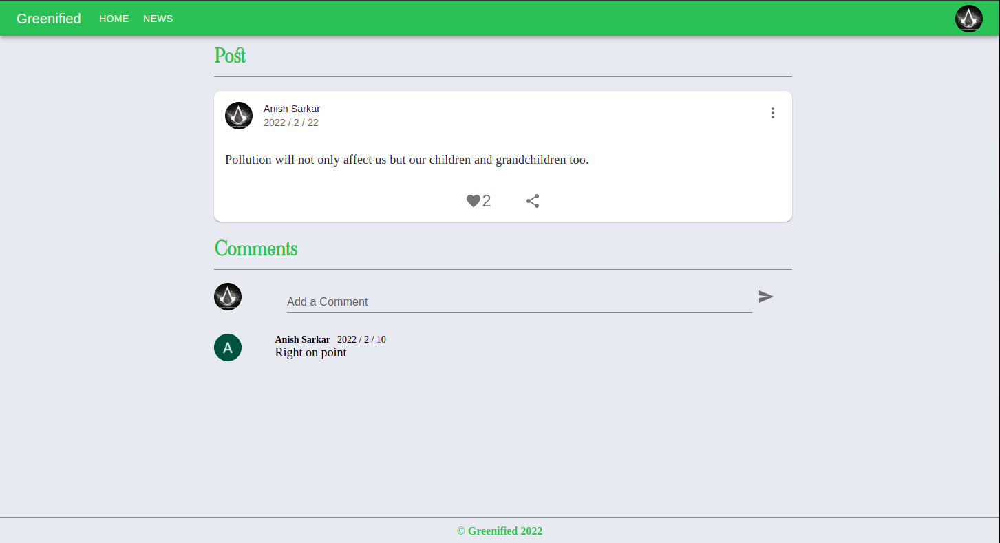
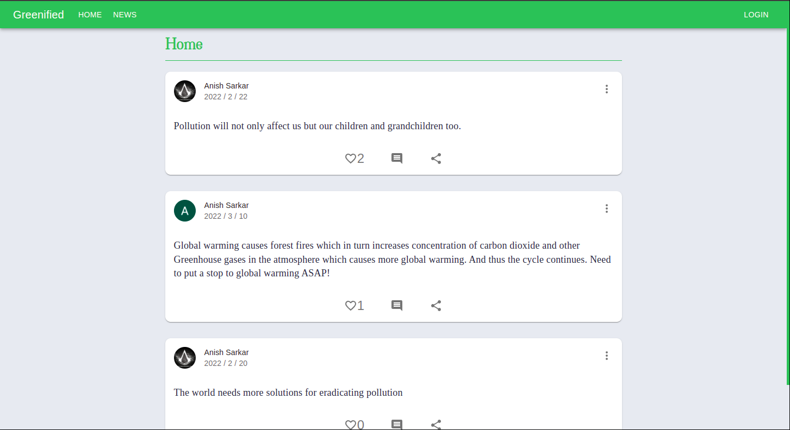
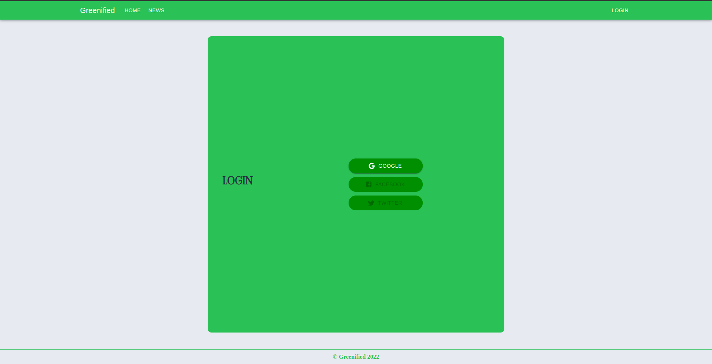

# GREENIFIED

[Live Site](https://greenified-bd05c.web.app/)

Greenified is a social media application made to create awareness about the pressing issue of environmental pollution and global warming.

Tech used: React, Node.JS, Express, MongoDB

To be implemented : A system to score users and their posts based on relevance and quality of content.

Frontend (React) deployed on Firebase.
Backend (Node.JS and Express) deployed on Heroku.

# Screenshots

